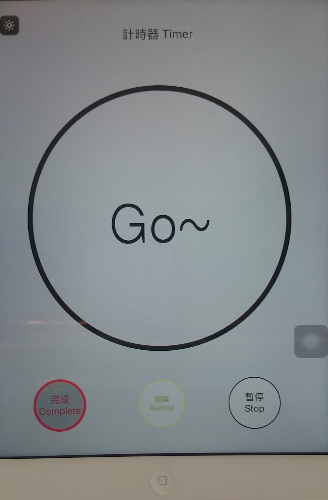
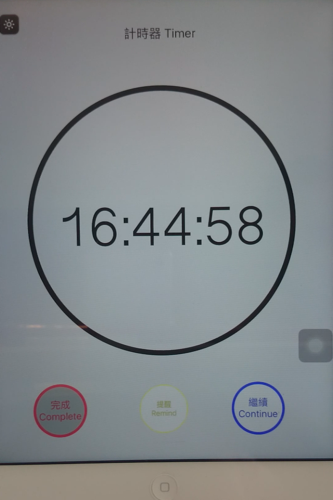
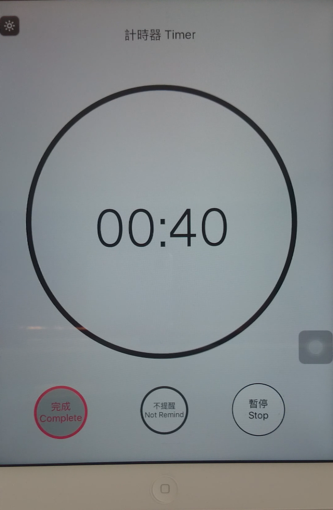
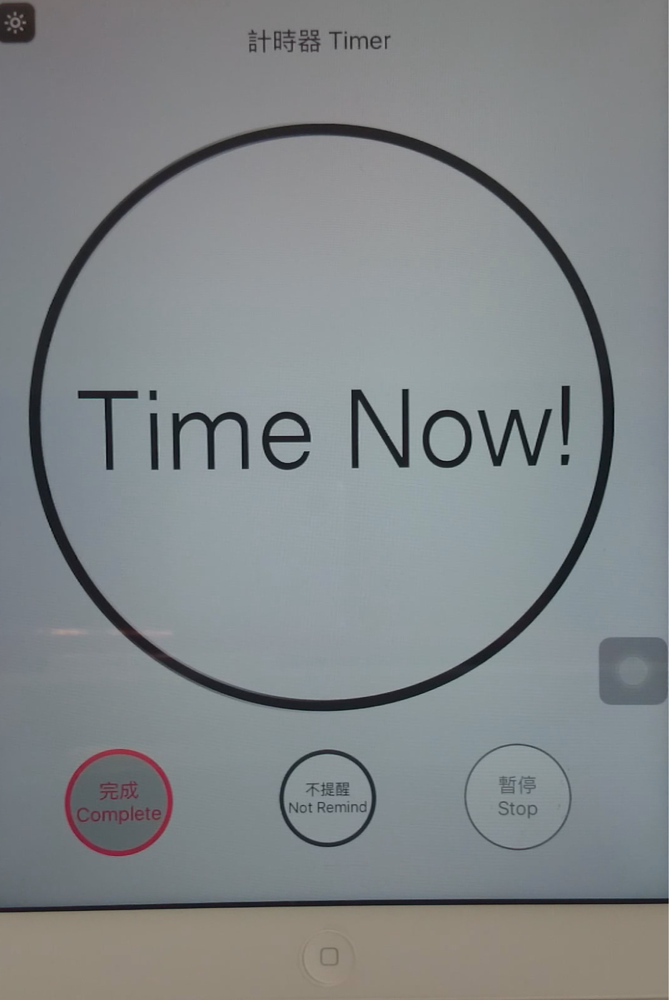

# iOS-Custom-Timer-And-Music-Remind--Reference-iOS-Timer-
## Introduction：
## Video：https://www.youtube.com/watch?v=q5mT870aCrU
###**[Demonstration Videos](https://www.youtube.com/watch?v=q5mT870aCrU)**.
(https://www.youtube.com/watch?v=q5mT870aCrU)

- 1.Set left Time, and Start timer. Of course you can Previously or timing set reminders music.

    `// If you set 2 minute.`

- 2.You can select "Stop", "Continue" and "Remind".

    `// You can cancel the reminder or stop timer.`

- 3.Time Now.

    `// Show message in the screen.`

Screen Image
===============

