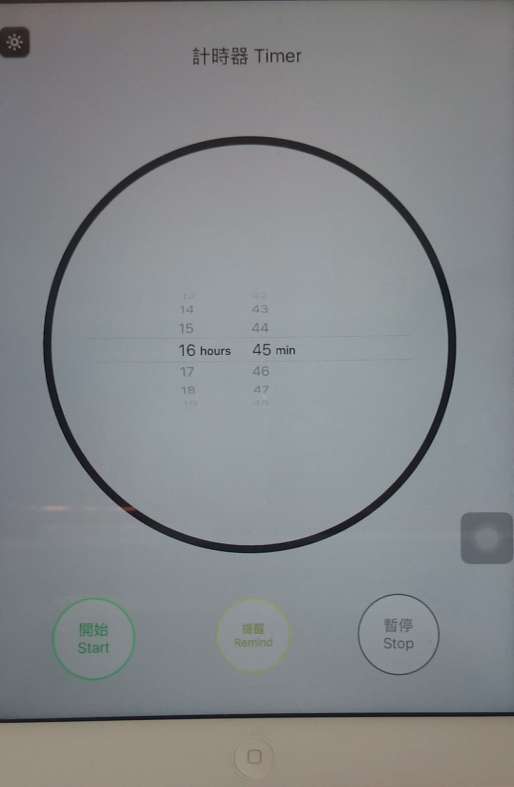

# iOS-Custom-Timer-And-Music-Remind--Reference-iOS-Timer-
## Introduction：
###**[Demonstration Videos](https://www.youtube.com/watch?v=q5mT870aCrU)**  (https://www.youtube.com/watch?v=q5mT870aCrU)

A simple iOS Custom Timer And Music Remind (Reference iOS Timer), Use device is iPad, if you are interested, you can try use AutoLayout to make various devices version.

- 1.Custom iBeacon "UUID", "Major", "Minor" and "Device Name".

    `// If you set 2 minute.`

- 2.Broadcasting iBeacon signal.

    `// You can cancel the reminder or stop timer.`
    

- 3.Use Android Phone open Estimote App searching iBeacon, check detected iBeacon information.

    `// Show message in the screen.`

- 4.Try modify  iBeacon "UUID", "Major", "Minor" and "Device Name" then Searching detected iBeacon information.

    `// Show message in the screen.`

- 5.Use Bluetooth Device search "Device Name" and understand the differences between the iBeacon Devcie and Bluetooth Device.

    `// Show message in the screen.`

##Screen Image：

